# 第一章: 初识Java #
Java是一种跨平台、面向对象的程序设计语言。本章节将简单介绍Java语言的不同版本及其相关特性以及学好Java语言的方法等，主要目的是让读者对Java语言有一个整体的了解，然后再慢慢地学习具体内容，最后达到完全掌握Java语言的目的。

## 本章目标：
- 了解Java语言
- 了解Java的版本
- 了解Java的应用领域
- 了解如何学好Java
- 了解Java语言特性
- 掌握不同平台的JDK环境搭建
- 掌握Java程序的编写方法

## 怎样学好Java
如何学好Java语言，是所有初学者需要共同面对的问题，其实每种语言的学习方法都大同小异，初学者需要注意的主要有以下几点：

- 明确自己的学习目标和大的方向，选择并锁定一门语言，按照自己的学习方向努力学习，认真研究。
- 初学者不用看太多的书，先找本相对基础的书系统的学习。
- 了解设计模式。学习一些设计模式，能够更好地把握项目的整体结构。
- 不要死记硬背。在刚接触一门语言，特别是Java语言时，掌握好基本语法，并大概了解一些功能即可。借助开发工具的代码辅助功能，完成代码的录入，这样可以快速进入学习状态。
- 多实践，多思考，多请教。
- 不要急躁。
- 遇到问题，首先尝试自己解决，这样可以提高自己的程序调试能力，并对常见问题有一定的了解，明白出错的原因，甚至举一反三，解决其他关联的错误问题。
- 多查阅资料。
- 多阅读别人的源代码。不但要看懂别人的程序代码，还要分析编程者的编程思想和设计模式并融为己用。

## Java API文档

> 点击图片可以链接到API官方网页

## [JDK版本](http://www.oracle.com/technetwork/java/api-141528.html)
### 按应用范围分3个版本
- Java SE
- Java EE
- Java ME

### JAVA STANDARD EDITION ###
- Java SE 9
- Java SE 8
- Java SE 7
- Java SE 6
- J2SE 1.5.0
- J2SE 1.4.2
- J2SE 1.3.1

## Java语言的特性
- 简单
- 面向对象
- 分布性
- 可移植性
- 解释型
- 安全性
- 健壮性
- 多线程
- 高性能
- 动态

## Windows下搭建Java环境
<table style="width: 100%">
	<thead>Windows下搭建Java环境</thead>
	<tr>
		<td width="80">第1步：</td>
		<td>JDK下载</td>
	</tr>
	<tr>
		<td>第2步：</td>
		<td>安装JDK</td>
	</tr>
	<tr>
		<td>第3步：</td>
		<td>系统环境配置</td>
	</tr>
	<tr>
		<td>第4步：</td>
		<td>测试安装环境</td>
	</tr>
</table>

### 1、JDK下载

[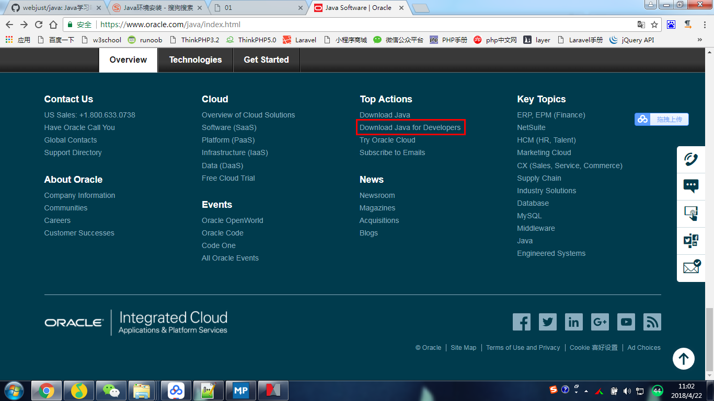](http://www.oracle.com/technetwork/java/javase/downloads/index.html)
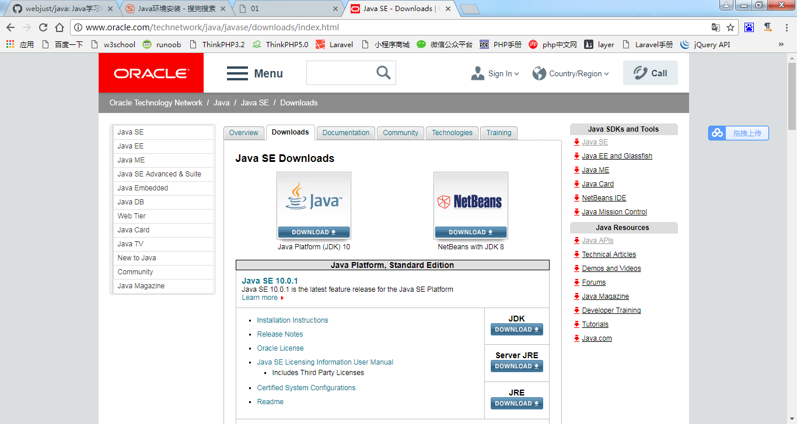
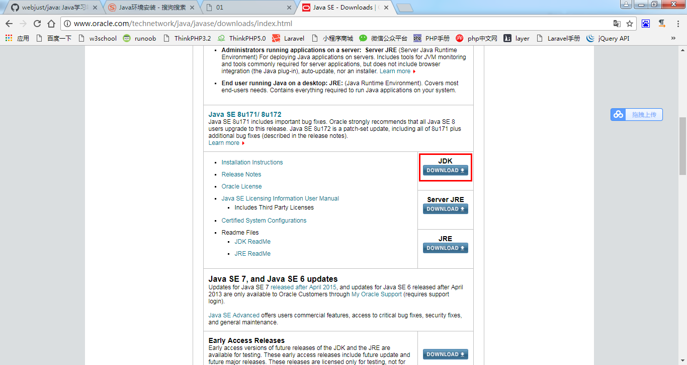
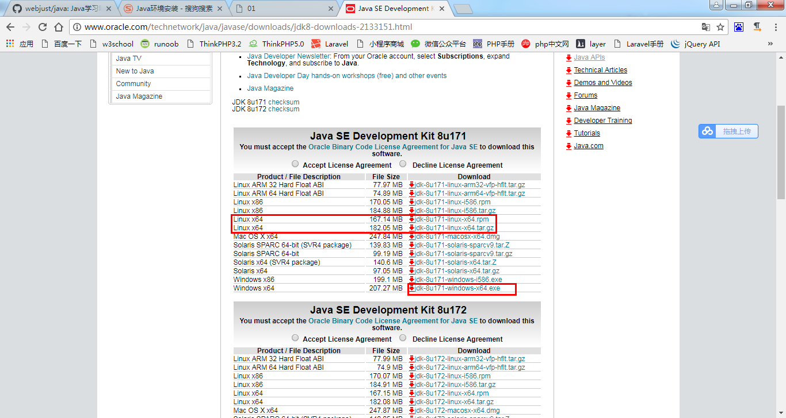

### 2、安装
注意：安装路径的选择，建议JDK安装路径为：`C:\Java\jdk1.8.0_161\`；安装过程中弹出JRE的目标文件夹对话框，这里可以修改JRE的安装路径为：`C:\Java\jre8\`。

### 3、系统环境配置
在「环境变量」中配置三个属性的值：`JAVA_HOME`，`CLASSPATH`，`Path`。

<table width="100%">
	<thead>
		Windows系统环境配置
	</thead>
	<tr>
		<td style="text-align: center;">
			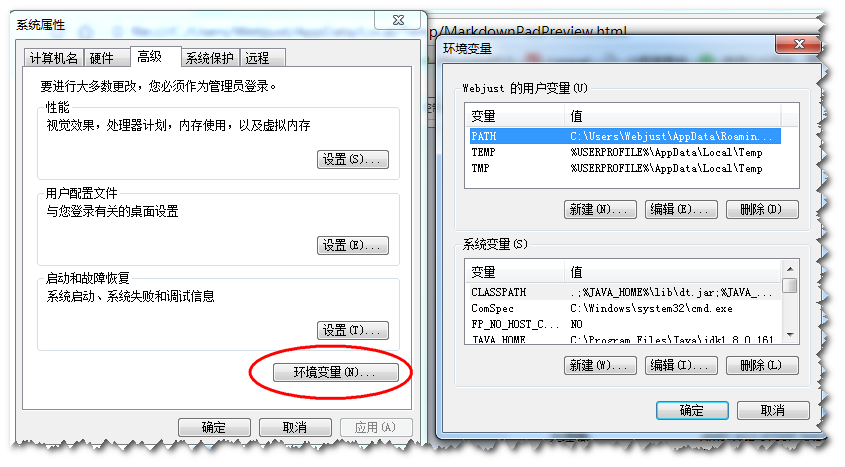
			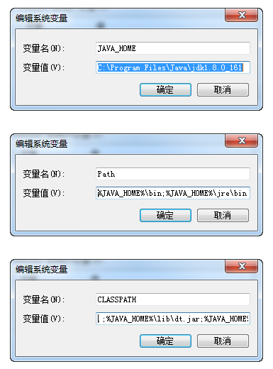
			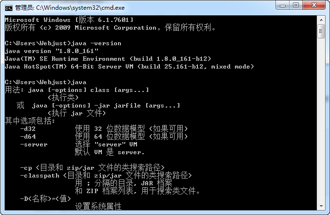
			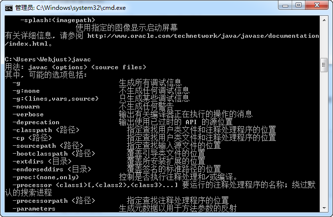
		</td>
	</tr>
</table>

在CMD命令行中使用命令：`java -version`, `java`, `javac` 检测是否成功的安装了 Java JDK。

#### 配置实例：

	– 变量名：JAVA_HOME
	– 变量值：C:\Program Files (x86)\Java\jdk1.8.0_91 // 要根据自己的实际路径配置

	– 变量名：CLASSPATH
	– 变量值：.;%JAVA_HOME%\lib\dt.jar;%JAVA_HOME%\lib\tools.jar; //记得前面有个”.”

	– 变量名：Path
	– 变量值：%JAVA_HOME%\bin;%JAVA_HOME%\jre\bin;

### 4、测试安装环境
编写第一个Java程序，输出"Hello World!"；

<table style="width: 100%">
	<tr>
		<td style="text-align: center;"></td>
	</tr>
</table>

注意：保存的文件名称为：*HelloWorld.java*

运行过程在CMD中执行下面几条命令：

	javac HelloWorld.java
	java HelloWorld

## Linux下搭建Java环境
### 操作系统
- Linux: CentOS6.8 64bit

### 源配置
- 阿里云：https://opsx.alibaba.com/

### 环境部署与学习建议
- 掌握Linux基础：权限、软件安装、常用命令、服务管理、防火墙
- Git
- [TomCat：JSP第一章](https://www.imooc.com/learn/166)
- [项目管理利器：Maven](https://www.imooc.com/learn/443)
- [MySQL基础入门](https://www.imooc.com/learn/122)

## 2-2 Linux软件源配置实操
###1、备份
	
	mv /etc/yum.repos.d/CentOS-Base.repo /etc/yum.repos.d/CentOS-Base.repo.backup

###2、下载新的CentOS-Base.repo 到/etc/yum.repos.d/

	wget -O /etc/yum.repos.d/CentOS-Base.repo http://mirrors.aliyun.com/repo/Centos-6.repo

###3、之后运行yum makecache生成缓存

## 2-3 JDK安装详解
- jdk下载
- jdk安装
- jdk验证

### 一、jdk下载 (步骤省略)

### 二、安装步骤
#### 1、清理系统默认自带jdk

	rpm -qa | grep jdk

	sudo yum remove XXX (XXX为上面的命令查询结果)

#### 2、赋予权限

	sudo chmod 777 jdk1.7.0_80.rpm

#### 3、安装
	
	sudo rpm -ivh jdk1.7.0_80.rpm

#### 4、默认安装路径： `/usr/java`
#### 5、jdk配置环境变量
**<1>. vim打开系统环境配置文件**

	sudo vim /etc/profile

**<2>. 在最下方增加：**

	export JAVA_HOME=/usr/java/jdk1.7.0_80
	export CLASSPATH=.:$JAVA_HOME/jre/lib/rt.jar:$JAVA_HOME/lib/dt.jar:$JAVA_HOME/lib/tools.jar
	
> 注：JAVA_HOME 为您安装jdk的路径。
	
**<3>. 在 export PATH 中添加 $JAVA_HOME/bin**

	export PATH=$PATH:$JAVA_HOME/bin

**<4>. 保存退出**

**<5>. 使配置生效**

	source /etc/profile

<table width="100%">
	<thead>
		图文步骤
	</thead>
	<tr>
		<td style="text-align: center;">
			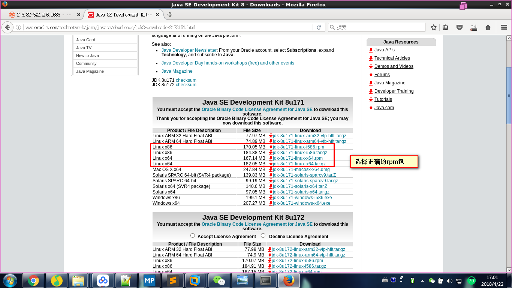
			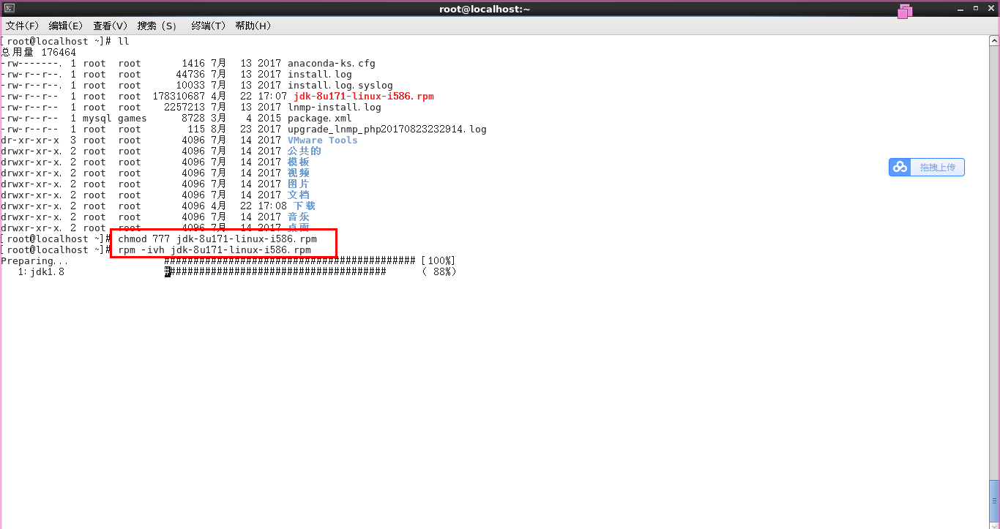
			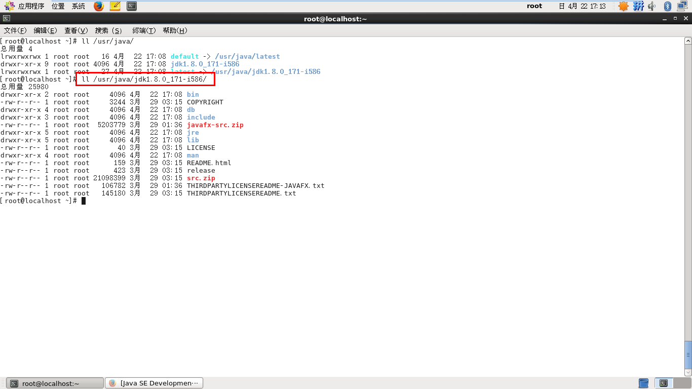
			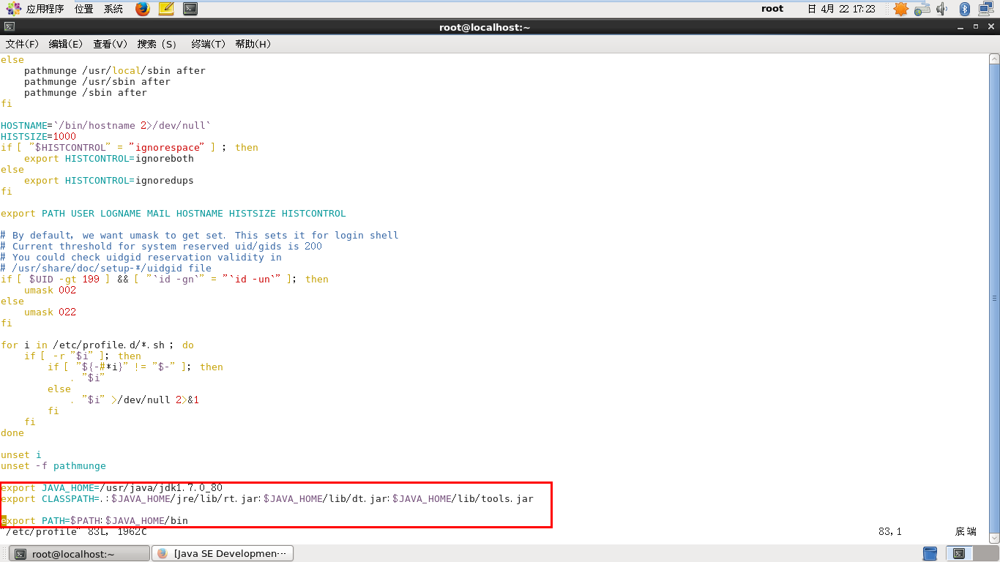
			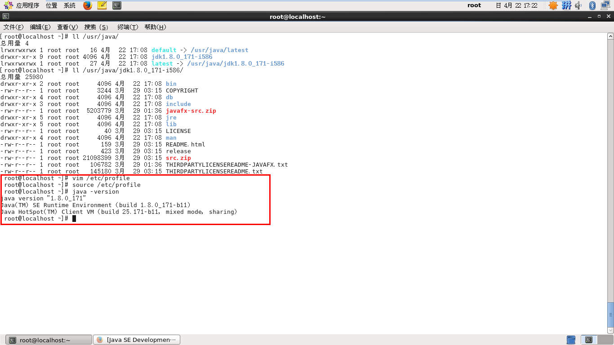
		</td>
	</tr>
</table>

### 三、jdk验证
执行 `java -version` 命令。

## 第一个Java程序
访问：[地址](./Ex_01_first_java_code.md)