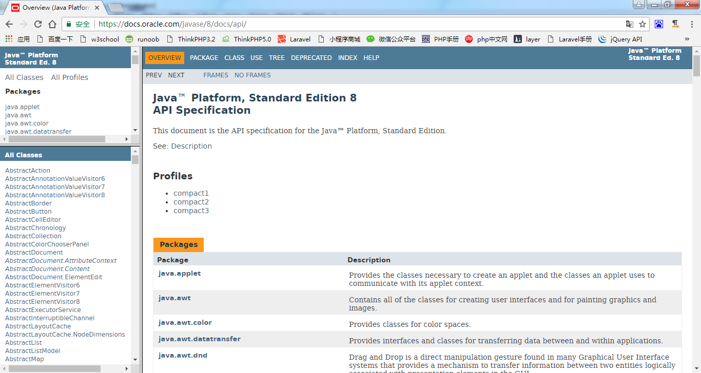

# 第一章: 初识Java #
Java是一种跨平台、面向对象的程序设计语言。本章节将简单介绍Java语言的不同版本及其相关特性以及学好Java语言的方法等，主要目的是让读者对Java语言有一个整体的了解，然后再慢慢地学习具体内容，最后达到完全掌握Java语言的目的。

## 本章目标：
- 了解Java语言
- 了解Java的版本
- 了解Java的应用领域
- 了解如何学好Java
- 了解Java语言特性
- 掌握不同平台的JDK环境搭建
- 掌握Java程序的编写方法

## 怎样学好Java
如何学好Java语言，是所有初学者需要共同面对的问题，其实每种语言的学习方法都大同小异，初学者需要注意的主要有以下几点：

- 明确自己的学习目标和大的方向，选择并锁定一门语言，按照自己的学习方向努力学习，认真研究。
- 初学者不用看太多的书，先找本相对基础的书系统的学习。
- 了解设计模式。学习一些设计模式，能够更好地把握项目的整体结构。
- 不要死记硬背。在刚接触一门语言，特别是Java语言时，掌握好基本语法，并大概了解一些功能即可。借助开发工具的代码辅助功能，完成代码的录入，这样可以快速进入学习状态。
- 多实践，多思考，多请教。
- 不要急躁。
- 遇到问题，首先尝试自己解决，这样可以提高自己的程序调试能力，并对常见问题有一定的了解，明白出错的原因，甚至举一反三，解决其他关联的错误问题。
- 多查阅资料。
- 多阅读别人的源代码。不但要看懂别人的程序代码，还要分析编程者的编程思想和设计模式并融为己用。

## Java API文档

## [JDK版本](http://www.oracle.com/technetwork/java/api-141528.html)
### 按应用范围分3个版本
- Java SE
- Java EE
- Java ME

### JAVA STANDARD EDITION ###
- Java SE 9
- Java SE 8
- Java SE 7
- Java SE 6
- J2SE 1.5.0
- J2SE 1.4.2
- J2SE 1.3.1

## Java语言的特性
- 简单
- 面向对象
- 分布性
- 可移植性
- 解释型
- 安全性
- 健壮性
- 多线程
- 高性能
- 动态

## Linux下搭建Java环境
## Windows下搭建Java环境