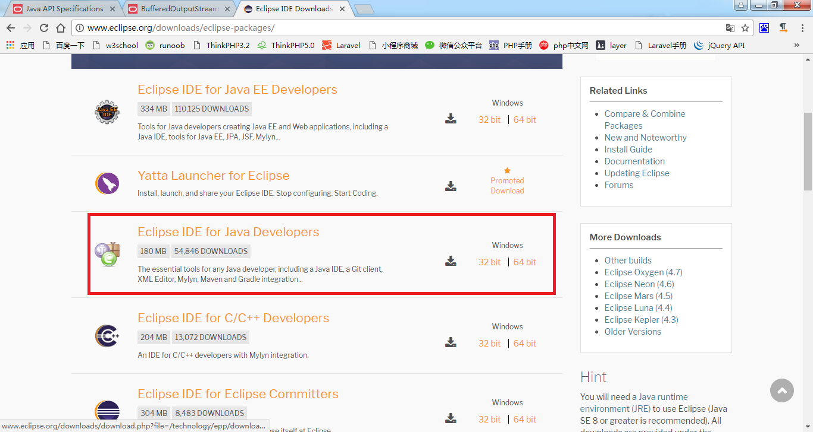
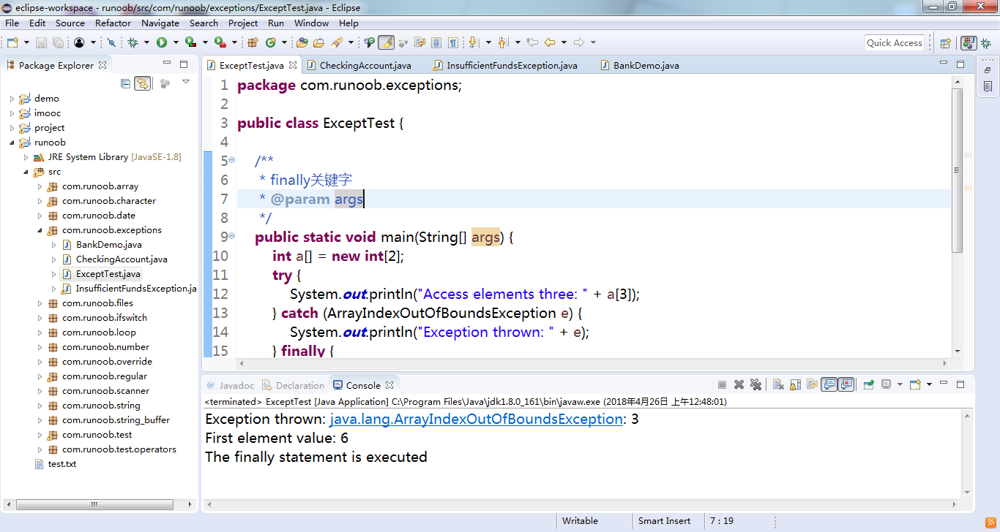

# 第二章: 熟悉Eclipse开发工具 #
学习Java语言程序设计必须选择一个功能强大、使用简单、能够辅助程序设计的IDE(集成开发工具)。Eclipse是目前最流行的Java语言开发工具之一，它具有强大的代码辅助功能，可以帮助程序开发人员自动完成语法修正、补全文字、代码修正、API提示等编码工作，大量节省程序开发所需的时间和精力。

## 本章目标：
- 掌握安装Eclipse的国际化语言包
- 学习Eclipse中经常使用的菜单和工具栏
- 学习使用Eclipse编写程序代码
- 掌握Eclipse中调试器的使用

## 下载

下载链接：[http://www.eclipse.org/downloads/eclipse-packages/](http://www.eclipse.org/downloads/eclipse-packages/)

## 熟悉Eclipse ##
### 1. Eclipse简介 ###

### 2. Eclipse工作台 ###

### 3. 使用Eclipse ###

### 4. 快捷键 ###

	Ctrl+Alt+/
	Alt+/
	Ctrl+1

## 程序调试 ##
F6: 单步跳过

F5: 单步跳入