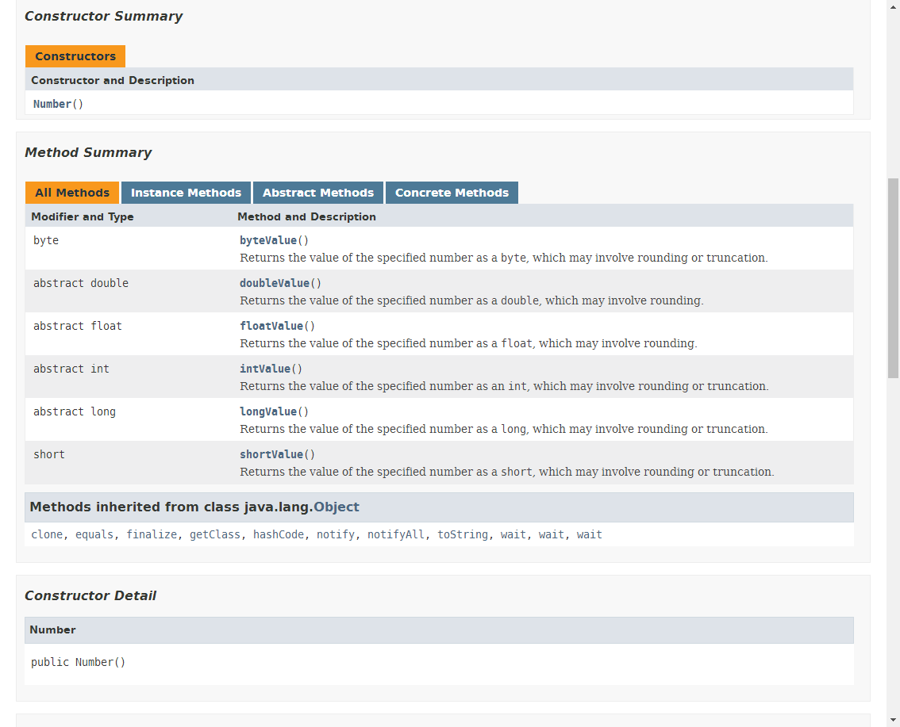

# 第八章: 包装类 #
Java是一种面向对象语言，Java中的类把方法与数据连接在一起，构成了自包含式的处理单元。但在Java中不能定义基本类型对象，为了能将基本类型视为对象进行处理，并能连接相关的方法，Java为每个基本类型都提供了包装类，如int型数值的包装类Integer和boolean型数值的包装类Boolean等，这样便可以把这些基本类型转换为对象来处理了。需要说明的是，Java是可以直接处理基本类型的，但在有些情况下需要将其作为对象来处理，这时就需要将其转换为包装类了。

## 本章目标：
- 掌握Integet对象的创建以及Integer类提供的各种方法
- 掌握Long对象的创建以及Long类提供的各种方法
- 掌握Short对象的创建以及Short类提供的各种方法
- 掌握Boolean对象的创建以及Boolean类提供的各种方法
- 掌握Byte对象的创建以及Byte类提供的各种方法
- 掌握Character对象的创建以及Character类提供的各种方法
- 掌握Double对象的创建以及Double类提供的各种方法
- 掌握Float对象的创建以及Float类提供的各种方法
- 了解所有数字类的父类Number

## 简介 ##
- Integer
- Byte
- Short
- Long
- Float
- Double
- Boolean
- Character
- Number

## Integer包装类 ##
java.lang 包中的 Integer类，Long类，Short类，Byte类，分别将基本类型 int, long, short, byte 封装成一个类。由于这些类都是 Number 的子类，区别就是封装不同的数据类型，其包含的方法基本相同，所以本节就以Integer类为例介绍整数包装类。

**api:** [https://docs.oracle.com/javase/8/docs/api/java/lang/Integer.html](https://docs.oracle.com/javase/8/docs/api/java/lang/Integer.html)

	/**
	 * Integer包装类
	 * @param args
	 */
	public static void main(String[] args) {
		Integer x = 5;
		x = x + 5;
		System.out.println(x);
	}
	
## Boolean类 ##
Boolean类将基本类型为 boolean 的值包装在一个对象中。一个 Boolean 类型的对象只包含一个类型为 boolean 的字段。此外，此类还为 boolean 和 String 的相互转换提供了许多方法，并提供了处理 boolean 时非常有用的其他一些常量和方法。

**api:** [https://docs.oracle.com/javase/8/docs/api/java/lang/Boolean.html](https://docs.oracle.com/javase/8/docs/api/java/lang/Boolean.html)

## Character 类 ##
Character类在对象中包装一个基本类型char值。一个 Character 类型的对象包含类型为 char 的单个字段。该类提供了几种方法，以确定字符的类别（小写字母、数字等），并将字符从大写转换为小写，反之亦然。

然而，在实际开发过程中，我们经常会遇到需要使用对象，而不是内置数据类型的情况。为了解决这个问题，Java语言为内置数据类型char提供了包装类Character类。

Character类提供了一系列方法来操纵字符。你可以使用Character的构造方法创建一个Character类对象，例如：

	Character ch = new Character('a');
	
在某些情况下，Java编译器会自动创建一个Character对象。

例如，将一个char类型的参数传递给需要一个Character类型参数的对象时，那么编译器会自动地将char类型参数转换为Character独享。这种特征称为装箱，反过来称为拆箱。

实例：

	/**
	 * Character类
	 * @param args
	 */
	public static void main(String[] args) {
		Character ch = 'a';
		char uniChar = '\u039A';
		char[] charArray = { 'a', 'b', 'c', 'd', 'e' };
		
		System.out.println("My Name's Bob, I Come From \"China\".");
	}
	
**api:** [http://www.runoob.com/manual/jdk1.6/java/lang/Character.html](http://www.runoob.com/manual/jdk1.6/java/lang/Character.html)

## Double 类 ##
Double 和 Float 包装类是对 double, float 基本类型的封装，它们都是 Number 类的子类，又都是对小数进行操作，所以常用方法基本相同。

**api:** [https://docs.oracle.com/javase/8/docs/api/java/lang/Double.html](https://docs.oracle.com/javase/8/docs/api/java/lang/Double.html)

## Number 类 ##
**api:** [https://docs.oracle.com/javase/8/docs/api/java/lang/Number.html](https://docs.oracle.com/javase/8/docs/api/java/lang/Number.html)

抽象类Number是：BigDecimal, BigInteger, Byte, Double, Float, Integer, Long, Short 类的父类，Number 的子类必须提供将表示的数值转换为 byte, double, float, int, long, short 的方法。

Number类的方法分别被Number的各子类所实现。

