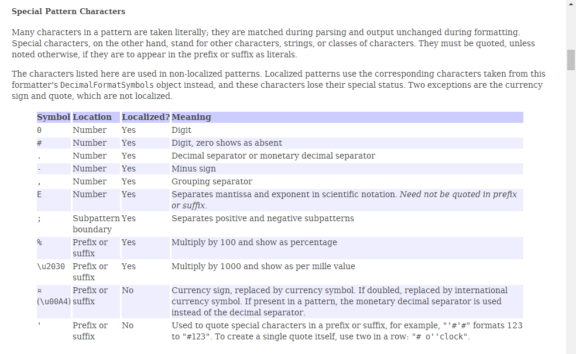

# 第九章: 数字处理类 #
在解决实际问题时，对数字的处理是非常普遍的，如数学问题、随机问题、商业货币问题、科学计数问题等。为了应对以上问题，Java提供了处理相关问题的类，包括DecimalFormat类, Math类, Random类, BigInteger类与BigDecimal类。

## 本章目标：
- 掌握对数字进行格式化
- 掌握Math类中的各种数学运算方法
- 掌握生成任意范围内的随机数
- 掌握大整数与大小数的数学运算方式

## 一、数字格式化 ##
数字的格式化在解决实际问题时使用非常普遍，如表示某超市的商品价格，需要保留两位有效数字。Java主要对浮点型数据进行数字格式化操作，其中浮点型数据包括 double 型和 float 型数据，在Java中使用 `java.text.DecimalFormat` 格式化数字。

**api:** [https://docs.oracle.com/javase/8/docs/api/java/text/DecimalFormat.html](https://docs.oracle.com/javase/8/docs/api/java/text/DecimalFormat.html)

### DecimalFormat类中特殊字符说明 ###

**例子：**

...

## 二、数学运算 ##
在Java语言中提供了一个执行数学基本运算的Math类。

**api:** [https://docs.oracle.com/javase/8/docs/api/java/lang/Math.html](https://docs.oracle.com/javase/8/docs/api/java/lang/Math.html)

## 三、随机数 ##
### Math.random()方法 ###

### Random类 ###
**api:** [https://docs.oracle.com/javase/8/docs/api/java/util/Random.html](https://docs.oracle.com/javase/8/docs/api/java/util/Random.html)

## 四、大数字运算 ##
https://docs.oracle.com/javase/8/docs/api/java/math/BigDecimal.html

https://docs.oracle.com/javase/8/docs/api/java/math/BigInteger.html

### Math类
	/**
	 * Math类
	 * @param args
	 */
	public static void main(String[] args) {
		System.out.println(Math.PI);
		System.out.println("90度的正弦值：" + Math.sin(Math.PI/2));
		System.out.println("0度的余弦值：" + Math.cos(0));
		System.out.println("60度的正切值：" + Math.tan(Math.PI/3));
		System.out.println("1的反正切值：" + Math.atan(1));
		System.out.println("π/2的角度值：" + Math.toDegrees(Math.PI/2));
	}
	
	public static void main(String[] args) {
		double[] nums = { 1.4, 1.5, 1.6, -1.4, -1.5, -1.6 };
		for (double num : nums) {
			test(num);
		}
	}

	private static void test(double num) {
		System.out.print(Math.floor(num));
		System.out.print(',');
		System.out.print(Math.round(num));
		System.out.print(',');
		System.out.print(Math.ceil(num));
		System.out.println();
	}