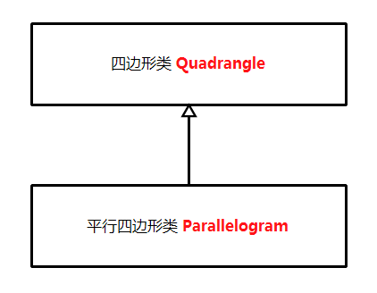
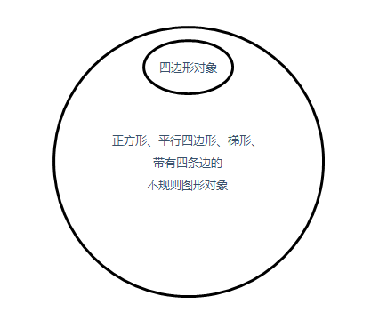
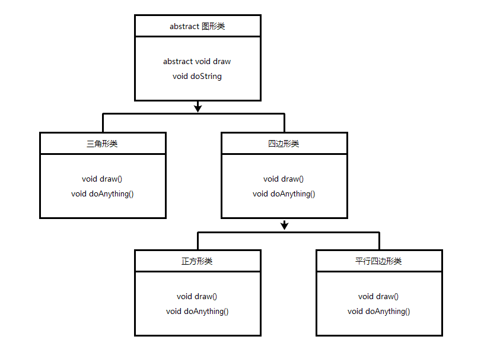
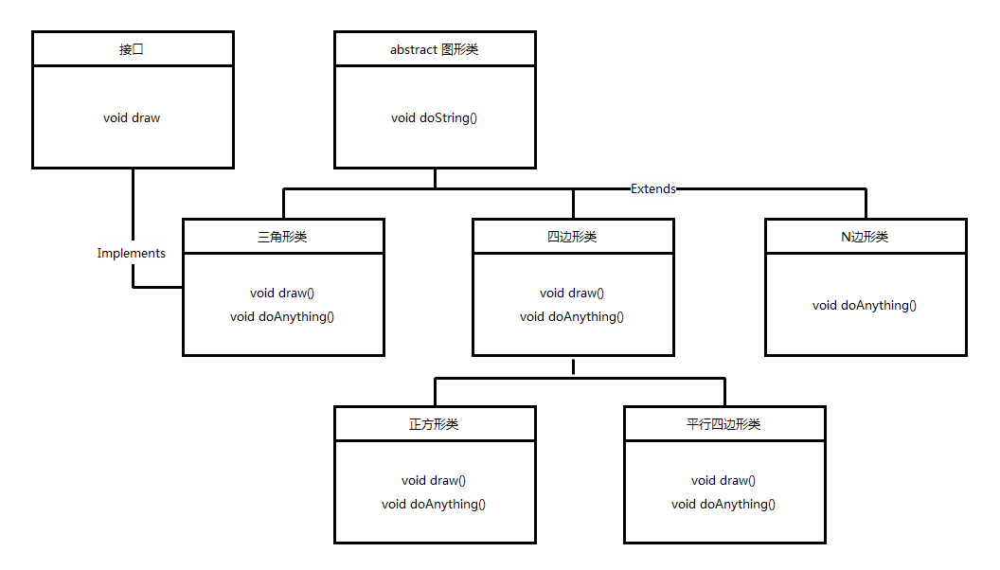

# 第十章: 接口、继承和多态 #
学习好继承和多态是面向对象开发语言中非常重要的一个环节，如果在程序中使用继承和多态得当，整个程序的架构将变得非常有弹性，同时可以减少代码的冗余性。继承机制的使用可以复用一些定义好的类，减少重复代码的编写。多态机制的使用可以动态调整对象的调用，降低对象之间的依存关系。为了优化继承与多态，一些类除了继承父类外还使用接口的形式。Java中的类可以同时实现多个接口，接口被用来建立类与类之间关联的标准。正因为使用了这些机制，才使Java语言更具有生命力。

## 本章目标：
- 掌握类的继承
- 掌握Object类中的几个重要方法
- 掌握对象类型的转换
- 掌握使用instanceof操作符判断对象类型
- 掌握方法的重载
- 掌握多态技术
- 掌握使用抽象类与接口

## 一、类的继承 ##
继承在面向对象开发思想中是一个非常重要的概念，它使整个程序架构具有一定的弹性，在程序中复用一些已经定义完善的类不仅可以减少软件开发周期，也可以提高软件的可维护性和可扩展性。本节将详细讲解类的继承。

在前面的章节中曾简要介绍过继承，其基本思想是基于某个父类的扩展，制定出一个新的子类，子类可以继承父类原有的属性和方法，也可以增加原来父类所不具备的属性和方法，或者直接重写父类中的某些方法。

在Java中使用 extends 关键字来标识两个类的继承关系。

例子：在项目中分别创建 Test 类和 Test2 类，在 Test 类中编写成员方法 doSomething() 和 doIt() ，使 Test2 类继承 Test 类，重写父类的这两个方法和构造方法，并新增 doSomethingnew() 方法。其中 Test2 类的构造方法中使用 super 关键字调用父类的构造方法和成员方法等。

	...

Test2类继承了Test类，可以说Test类为Test2类的父类，Test2类为Test类的子类。在子类中可以连同初始化父类构造方法来完成子类初始化操作，既可以在子类的构造方法中使用super()语句调用父类的构造方法，也可以在子类中使用super关键字调用父类的成员方法等。但是子类没有权限调用父类中被修饰为pricate的方法，只可以调用父类中修饰为public或protected的成员方法。

继承并不只是扩展父类的功能，还可以重写父类的成员方法。重写就是在子类中将父类的成员方法的名称保留，重写成员方法的实现内容，更改成员方法的存储权限，或是修改成员方法的返回值类型。

在继承中还有一种特殊的重写方式，子类与父类的成员方法返回值、方法名称、参数类型及个数完全相同，唯一不同的是方法实现内容，这种特殊重写方式被称为重构。

> 注意：当重写父类方法时，修改方法的权限只能从小的范围到大的范围改变，不能降低方法的修饰权限范围。

子类重写父类的方法还可以修改方法的返回值类型，但这只是在J2SE5.0以上的版本中支持的新功能。例如：doIt()方法就使用了这个新功能，父类中的doIt()方法的返回值类型为Test，而子类中的doIt()方法的返回值类型为Test2，子类中重写了父类的doIt()方法。这种重写方式需要遵循一个原则，即重写的返回值类型必须是父类中同一方法返回值类型的子类，而Test2类正是Test类的子类。

在Java中一切都以对象的形式进行处理，在继承的机制中，创建一个子类对象，将包含一个父类子对象，这个对象与父类创建的对象是一样的。两者的区别在于后者来自外部，而前者来自子类对象的内部。当实例化子类对象时，父类对象也相应被实例化，换句话说，在实例化子类对象时，Java编译器会在子类的构造方法中自动调用父类的无参构造方法。为了验证这个理论，来看下面的实例。

例子：在项目中创建 Subroutine 类和两个父类，分别为 Parent 和 SubParent 类。这3个类的继承关系是 Subroutine 类 继承 SubParent 类，而 SubParent 继承 Parent 类。分别在这3个类的构造方法中输出构造方法名称，然后创建 Subroutine 类的实例化对象，继承机制将使该类的父类对象自动初始化。

...

在子类 Subroutine 的主方法中只调用子类的构造方法实例化子类对象，并且在子类构造方法中没有调用父类构造方法的任何语句，但是在实例化子类对象时它相应调用了父类的构造方法。在结果中可以看到调用构造方法的顺序，首先是顶级父类，然后是上一级父类，最后是子类。也就是说，实例化子类对象时首先要实例化父类对象，然后再实例化子类对象，所以在子类构造方法访问父类的构造方法之前，父类已经完成实例化操作。

> 说明：在实例化子类对象时，父类无参构造方法将被自动调用，但有参构造方法并不能被自动调用，只能依赖于super关键字显式地调用父类的构造方法。

>技巧：如果使用 finalize() 方法对对象进行清理，需要确保子类的 finalize() 方法的最后一个动作是调用父类的 finalize() 方法，以保证当垃圾回收对象占用内存时，对象的所有部分都能被正常终止。

## 二、Object类 ##
在开始学习使用class关键字定义类时，就应用到了继承原理，因为在Java中，所有的类都直接或间接地继承了java.lang.Object类。Object类是比较特殊的类，它是所有类的父类，是Java类层中的最高层类。当创建一个类时，总是在继承，除非某个类已经制定要从其他类继承，否则它就是从java.lang.Object类继承而来的，可见Java中的每个类都源于java.lang.Object类，如String, Integer等类都是继承于Object类，除此之外，自定义的类也都继承于Object类。由于所有类都是Object子类，所以在定义类时，省略了 extends Object关键字。

	class Anything() {
		...
	}
	等价于
	class Anything extends Object() {
		...
	}
	
在Object类中主要包括clone(), finalize(), equals(), toString()等方法，其中常用的两个方法为equals()和toString()方法。由于所有的类都是Object类的子类，所以任何类都可以重写Object类中的方法。

> 注意：Object类中的getClass(), notify(), notifyAll(), wait()等方法不能被重写，因为这些方法被定义为final类型。

**api:** [https://docs.oracle.com/javase/8/docs/api/java/lang/Object.html](https://docs.oracle.com/javase/8/docs/api/java/lang/Object.html)

下面详细讲述Object类中的几个重要方法。

**2.1、getClass()方法**

getClass()方法是Object类定义的方法，它会返回对象执行时的Class实例，然后使用此实例调用getName()方法可以取得类的名称。

	getClass().getname();

**2.2、toString()方法**

toString()方法的功能是将一个对象返回为字符串形式，它会返回一个String实例。在实际的应用中通常重写 toString() 方法，为对象提供一个特定的额输出模式。当这个类转换为字符串或与字符串连接时，将自动调用重写的 toString() 方法。

例子：

	...

**2.3、equals()方法**

"=="比较的是两个对象的引用是否相等，而equals()方法是比较的两个对象的实际内容。

例子：

	...

## 三、对象类型的转换 ##
对象类型的转换在Java编程中经常遇到，主要包括向上转型与向下转型操作。

### 向上转型 ###
因为平行四边形是特殊的四边形，也就是说**平行四边形是四边形的一种**，那么就可以将平行四边形对象看作是一个四边形对象。

平行四边形类继承了四边形类，四边形类存在一个 `draw()` 方法，它的参数是 `Quadrangle` 类型，而在平行四边形类的主方法中调用 `draw()` 时给与的参数类型却是 `Parallelogram` 类型的。

这里一直在强调一个问题，这就相当于 `Quadrangle obj=new Parallelogram();`，就是**把子类对象赋值给父类类型的变量，这种技术被称为“向上转型”。**

**这种将子类对象看作是父类对象被称为“向上转型”。**由于向上转型是从一个较具体的类到较抽象的类的转换，所以它总是安全的，如可以说平行四边形是特殊的四边形，但不能说四边形是平行四边形。

试想一下正方形类对象可以作为 `draw()` 方法的参数，梯形类对象同样也可以作为 `draw()` 方法的参数，如果在四边形类的 `draw()` 方法中根据不同的图形对象设置不同的处理，就可以做到在父类中定义一个方法完成各个子类的功能，这样可以使同一份代码毫无差别地运用到不同类型之上，这就是多态机制的基本思想。

实例：在项目中创建 Parallelogram 类，再创建 Quadrangle 类，并使 Parallelogram 类继承 Quadrangle 类，然后再主方法中调用父类的 draw() 方法。

	...

### 向下转型 ###
通过向上转型可以推理出：**“向下转型”是将较抽象类转换为较具体的类。**这样的转型通常会出现问题，例如不能说四边形是平行四边形的一种，所有的鸟类都是鸽子，因为这非常不符合逻辑。可以说：**子类对象总是父类的一个实例，但父类对象不一定是子类的实例。**

实例：修改上一个实例，在 Parallelogram 类的主方法中将父类 Quadrangle 的对象赋值给子类 Parallelogram 的对象的引用变量将使程序产生错误。

	...

从实例中可以看到，如果将父类对象直接赋予子类，会产生编译器错误，因为父类对象不一定是子类的实例。下图表明了这些图形的关系。

例如：一个四边形不一定就是指平行四边形，它也许是梯形，也许是正方形，也许是其它带有四条边的不规则图形。越是具体的对象具有的特性越多，越抽象的对象具有的特性越少。在做向下转型操作时，将特性范围小的对象转换为特性范围大的对象肯定会出现问题，所以这时需要告知编译器这个四边形就是平行四边形。**将父类对象强制转换为某个子类对象，这种方式称为显式类型转换。**

当在程序中使用向下转型技术时，必须使用显式类型转换，向编译器指明将父类对象转换为哪一种类型的子类对象。

## 四、使用instanceof操作符判断对象类型 ##
当在程序执行向下转型操作时，如果父类对象不是子类对象的实例，就会发生 `ClassCastException` 异常，所以在执行向下转型之前需要养成一个良好的习惯，就是**判断父类对象是否为子类对象的实例。**这个判断通常使用 `instanceof` 操作符来完成。可以使用 `instanceof` 操作符判断是否一个类实现了某个接口，也可以用它来判断一个实例对象是否属于一个类。

	myobject instanceof ExampleClass

使用 instanceof 操作符的表达式返回值为布尔值。如果返回 `true`，说明 `myobject` 对象为 `ExampleClass` 的实例对象；如果返回 `false`，说明 `myobject` 对象不是 `ExampleClass` 的实例对象。

**实例：**在项目中创建 `Parallelogram` 类和 `Quadrangle`、`Square`、`Anything` 三个类。其中 `Parallelogram` 类和 `Square` 类继承 `Quadrangle` 类，在 `Parallelogram` 类的主方法中分别创建这些类的对象，然后使用 instanceof 操作符判断它们的类型并输出结果。

	...

在该实例中将 `instanceof` 操作符与向下转型操作结合使用。在程序中定义了两个子类，即平行四边形类和正方形类，这两个类分别继承四边形类。在主方法中首先创建四边形类对象，然后使用 `instanceof` 操作符判断四边形类对象是否为平行四边形类的一个实例，是否为正方形类的一个实例，如果判断结果为 `true` ，将进行向下转型操作。

## 五、方法的重载 ##
构造方法的名称已经由类名决定，所以构造方法只有一个名称，但如果希望以不同的方式来实例化对象，就需要使用多个构造方法来完成。由于这些构造方法都需要根据类名命名，为了让方法名相同而形参不同的构造方法同时存在，必须用到“方法重载”。虽然方法重载起源于构造方法，但是它也可以应用到其他方法中。

**方法的重载就是在同一个类中允许同时存在一个以上的同名方法，只要这些方法的参数个数或类型不同即可。**

### 定长参数重载 ###
实例：在项目中创建 OverLoadTest 类，在类中编写 add() 方法的多个重载形式，然后再主方法中分别输出这些方法的返回值。

	...

### 定义不定长参数方法 ###

----------

### Java Override/Overload ###
#### 重写 Override
重写是子类对父类的允许访问的方法的实现过程进行重新编写，返回值和形参不能改变。

重写的好处在于子类可以根据需要，定义特定于自己的行为。也就是说子类能够根据需要实现父类的方法。

重写方法不能抛出新的检查异常或者比被重写方法申明更加宽泛的异常。例如：父类的一个方法声明了一个检查异常 IOException ，但是在重写这个方法的时候不能抛出 Exception 异常，因为 Exception 是 IOException 的父类，只能抛出 IOException 的子类异常。

在面向对象原则里，重写意味着可以重写任何现有方法。实例如下：

	....

#### 方法的重写规则 ####
- 参数列表必须完全与被重写方法的相同；
- 返回类型必须与被重写方法的返回类型相同；
- 访问权限不能比父类中被重写的方法的访问权限更低。
- 父类的成员方法，只能被他的子类重写。

#### Super关键字
#### 重载 Overload
#### 重写与重载的区别

## 六、多态 ##
利用多态可以使程序具有良好的扩展性，并可以对所有类对象进行通用的处理。在前面我们已经学习过对象可以作为父类的对象实例使用，这种将子类对象视为父类对象的做法称为“向上转型”。假如现在需要绘制一个平行四边形，这时可以在平行四边形类中定义一个 draw() 方法，具体实现代码如下所示。

实例：定义一个平行四边形的类 Parallelogram，在类中顶一个 draw() 方法。

	...
	
如果需要定义一个绘制正方形的方法，通过定义一个正方形类来处理正方形对象，会出现代码冗余的缺点；通过定义一个正方形和平行四边形的综合类，分别处理正方形和平行四边形对象，也没有太大意义。

如果定义一个四边形类，让它处理所有的继承类的对象，根据向上转型原则可以使每个继承四边形类的对象作为 draw() 方法的参数，然后在 draw() 方法中作一些限定就可以根据不同图形类对象绘制相应的图形，从而以更为通用的四边形类来取代具体的正方形类和平行四边形类。这样处理能够很好地解决代码冗余问题，同时也易于维护，因为可以加入任何继承父类的子类对象，而父类方法也无须修改。

实例：创建四边形类的具体实现。创建 Quadrangle 类，再分别创建两个内部类 Square 和 Parallelogram ，它们都继承了 Quadrangle 类。编写 draw() 方法，该方法接收 Quadrangle 类的对象作为参数，即使用这两个内部类的父类作为方法参数。在主方法中分别以两个内部类的实例对象作为参数执行 draw() 方法。

	...
	
从该实例的运行结果可以看出，以不同类对象为参数调用 draw() 方法可以处理不同的图形问题。使用多态节省了开发和维护时间，因为程序员无须在所有的子类中定义执行相同功能的方法，避免了大量重复代码的开发，同时只要实例化一个继承父类的子类对象即可调用相应的方法，这里只要维护父类中的这个方法即可。

## 七、抽象类与接口 ##
### 抽象类 ###
在解决实际问题时，一般将父类定义为抽象类，需要使用这个父类进行继承与多态处理。回想继承和多态原理，继承树中越是在上方的类越抽象。在多态机制中，并不需要将父类初始化对象，我们需要的只是子类对象，所以在Java语言中设置抽象类不可以实例化对象，因为图形类不能抽象出任何一种具体图形，但它的子类却可以。

抽象类的语法格式如下：

	public abstract class Test{
		abstract void testAbstract();	// 定义抽象方法
	}
	
其中，abstract 是定义抽象类的关键字。

使用 abstract 关键字定义的类称为抽象类，而使用这个关键字定义的方法称为抽象方法。抽象方法没有方法体，这个方法本身没有任何意义，除非它被重写，而重载这个抽象方法的抽象类必须被继承，实际上抽象类除了被继承之外没有任何意义。

反过来讲，如果声明一个抽象的方法，就必须将承载这个抽象方法的类定义为抽象类，不可能在非抽象类中获取抽象方法。换句话说，只要类中有一个抽象方法，此类就被标记为抽象类。

抽象类被继承后需要实现其中所有的抽象方法，也就是保证相同的方法名称、参数列表和相同的返回值类型创建出非抽象方法，当然也可以是抽象方法。

### 接口 ###
接口是抽象类的延伸，可以将它看作是纯粹的抽象类，接口中的所有方法都没有方法体。对于上一小节遗留的为，可以将 draw() 方法封装在一个接口中，使需要 draw() 方法的类实现这个接口，同时也继承图形类，这就是接口存在的必要性。

接口使用 interface 关键字进行定义：

	public interface drawTest{
		void draw();	// 接口内的方法，省略abstract关键字
	}
	
一个类实现一个接口可以使用 implements 关键字，代码如下：

	public class Parallelogram extends Quadrangle implements drawTest{
		...//
	}
	
> 注意：在接口中定义的方法必须被定义为 public 或 abstract 形式，其他修饰权限不被java编译器认可，即使不将该方法声明为 public 形式，它也是 public。接口中定义的任何字段都自动是 static 和 final 的。

实例：将修改上一小节的例子，将多态技术与接口相结合。在项目中创建 QuadrangleUseInterface 类，在类中创建两个继承该类的内部类 ParallelogramUseInterface 和 SquareUseInterface；再创建 drawTest 接口，并使前两个内部类实现该接口；然后再主方法中分别调用这两个内部类的 draw() 方法。

	...
	
在本实例中，正方形类与平行四边形类分别实现了 drawTest 接口并继承了四边形类，所以需要覆盖接口中的方法。在调用 draw() 方法时，首先将平行四边形类对象与正方形类对象向上转型为 drawTest 接口形式。**在Java中无论是将一个类向上转型为父类对象，还是向上转型为抽象父类对象，或者向上转型为该类实现接口，都是没有问题的。**然后使用 d[i] 数组中的每一个对象调用 draw()，由于向上转型，所以 d[i] 数组中的每一个对象分别代表正方形类对象与平行四边形类对象，最后接口分别调用正方形类与平行四边形类中覆盖的 draw() 方法。

### 接口与继承 ###
我们知道在Java中不允许多重继承，但使用接口就可以实现多重继承，因为一个类可以同时实现多个接口，这样可以将所有需要继承的接口放置在 implements 关键字后并使用逗号隔开，但这可能会在一个类中产生庞大的代码量，因为继承一个接口时需要实现接口中所有的方法。

多重继承的语法如下：

	class 类名 implements 接口1,接口2,...,接口n