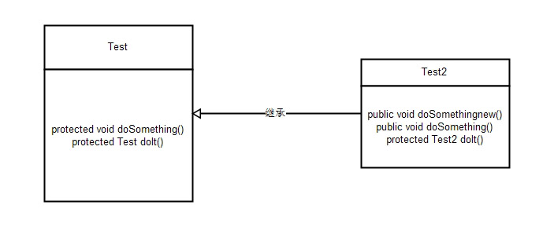

# 第十章: 接口、继承和多态 #
学习好继承和多态是面向对象开发语言中非常重要的一个环节，如果在程序中使用继承和多态得当，整个程序的架构将变得非常有弹性，同时可以减少代码的冗余性。继承机制的使用可以复用一些定义好的类，减少重复代码的编写。多态机制的使用可以动态调整对象的调用，降低对象之间的依存关系。为了优化继承与多态，一些类除了继承父类外还使用接口的形式。Java中的类可以同时实现多个接口，接口被用来建立类与类之间关联的标准。正因为使用了这些机制，才使Java语言更具有生命力。

## 本章目标：
- 掌握类的继承
- 掌握Object类中的几个重要方法
- 掌握对象类型的转换
- 掌握使用instanceof操作符判断对象类型
- 掌握方法的重载
- 掌握多态技术
- 掌握使用抽象类与接口

## 一、类的继承 ##
继承在面向对象开发思想中是一个非常重要的概念，它使整个程序架构具有一定的弹性，在程序中复用一些已经定义完善的类不仅可以减少软件开发周期，也可以提高软件的可维护性和可扩展性。本节将详细讲解类的继承。

在前面的章节中曾简要介绍过继承，其基本思想是基于某个父类的扩展，制定出一个新的子类，子类可以继承父类原有的属性和方法，也可以增加原来父类所不具备的属性和方法，或者直接重写父类中的某些方法。

在Java中使用 extends 关键字来标识两个类的继承关系。

例子：在项目中分别创建 Test 类和 Test2 类，在 Test 类中编写成员方法 doSomething() 和 doIt() ，使 Test2 类继承 Test 类，重写父类的这两个方法和构造方法，并新增 doSomethingnew() 方法。其中 Test2 类的构造方法中使用 super 关键字调用父类的构造方法和成员方法等。

...

Test2类继承了Test类，可以说Test类为Test2类的父类，Test2类为Test类的子类。在子类中可以连同初始化父类构造方法来完成子类初始化操作，既可以在子类的构造方法中使用super()语句调用父类的构造方法，也可以在子类中使用super关键字调用父类的成员方法等。但是子类没有权限调用父类中被修饰为pricate的方法，只可以调用父类中修饰为public或protected的成员方法。

继承并不只是扩展父类的功能，还可以重写父类的成员方法。重写就是在子类中将父类的成员方法的名称保留，重写成员方法的实现内容，更改成员方法的存储权限，或是修改成员方法的返回值类型。

在继承中还有一种特殊的重写方式，子类与父类的成员方法返回值、方法名称、参数类型及个数完全相同，唯一不同的是方法实现内容，这种特殊重写方式被称为重构。

> 注意：当重写父类方法时，修改方法的权限只能从小的范围到大的范围改变，不能降低方法的修饰权限范围。

子类重写父类的方法还可以修改方法的返回值类型，但这只是在J2SE5.0以上的版本中支持的新功能。例如：doIt()方法就使用了这个新功能，父类中的doIt()方法的返回值类型为Test，而子类中的doIt()方法的返回值类型为Test2，子类中重写了父类的doIt()方法。这种重写方式需要遵循一个原则，即重写的返回值类型必须是父类中同一方法返回值类型的子类，而Test2类正是Test类的子类。

在Java中一切都以对象的形式进行处理，在继承的机制中，创建一个子类对象，将包含一个父类子对象，这个对象与父类创建的对象是一样的。两者的区别在于后者来自外部，而前者来自子类对象的内部。当实例化子类对象时，父类对象也相应被实例化，换句话说，在实例化子类对象时，Java编译器会在子类的构造方法中自动调用父类的无参构造方法。为了验证这个理论，来看下面的实例。

例子：在项目中创建 Subroutine 类和两个父类，分别为 Parent 和 SubParent 类。这3个类的继承关系是 Subroutine 类 继承 SubParent 类，而 SubParent 继承 Parent 类。分别在这3个类的构造方法中输出构造方法名称，然后创建 Subroutine 类的实例化对象，继承机制将使该类的父类对象自动初始化。

...

在子类 Subroutine 的主方法中只调用子类的构造方法实例化子类对象，并且在子类构造方法中没有调用父类构造方法的任何语句，但是在实例化子类对象时它相应调用了父类的构造方法。在结果中可以看到调用构造方法的顺序，首先是顶级父类，然后是上一级父类，最后是子类。也就是说，实例化子类对象时首先要实例化父类对象，然后再实例化子类对象，所以在子类构造方法访问父类的构造方法之前，父类已经完成实例化操作。

> 说明：在实例化子类对象时，父类无参构造方法将被自动调用，但有参构造方法并不能被自动调用，只能依赖于super关键字显式地调用父类的构造方法。

>技巧：如果使用 finalize() 方法对对象进行清理，需要确保子类的 finalize() 方法的最后一个动作是调用父类的 finalize() 方法，以保证当垃圾回收对象占用内存时，对象的所有部分都能被正常终止。

## 二、Object类 ##
在开始学习使用class关键字定义类时，就应用到了继承原理，因为在Java中，所有的类都直接或间接地继承了java.lang.Object类。Object类是比较特殊的类，它是所有类的父类，是Java类层中的最高层类。当创建一个类时，总是在继承，除非某个类已经制定要从其他类继承，否则它就是从java.lang.Object类继承而来的，可见Java中的每个类都源于java.lang.Object类，如String, Integer等类都是继承于Object类，除此之外，自定义的类也都继承于Object类。由于所有类都是Object子类，所以在定义类时，省略了 extends Object关键字。

	class Anything() {
		...
	}
	等价于
	class Anything extends Object() {
		...
	}
	
在Object类中主要包括clone(), finalize(), equals(), toString()等方法，其中常用的两个方法为equals()和toString()方法。由于所有的类都是Object类的子类，所以任何类都可以重写Object类中的方法。

> 注意：Object类中的getClass(), notify(), notifyAll(), wait()等方法不能被重写，因为这些方法被定义为final类型。

**api:** [https://docs.oracle.com/javase/8/docs/api/java/lang/Object.html](https://docs.oracle.com/javase/8/docs/api/java/lang/Object.html)

下面详细讲述Object类中的几个重要方法。

**2.1、getClass()方法**

getClass()方法是Object类定义的方法，它会返回对象执行时的Class实例，然后使用此实例调用getName()方法可以取得类的名称。

	getClass().getname();

**2.2、toString()方法**

toString()方法的功能是将一个对象返回为字符串形式，它会返回一个String实例。在实际的应用中通常重写 toString() 方法，为对象提供一个特定的额输出模式。当这个类转换为字符串或与字符串连接时，将自动调用重写的 toString() 方法。

例子：

	...

**2.3、equals()方法**

"=="比较的是两个对象的引用是否相等，而equals()方法是比较的两个对象的实际内容。

例子：

	...

## 三、对象类型的转换 ##
对象类型的转换在Java编程中经常遇到，主要包括向上转型与向下转型操作。

## 四、使用instanceof操作符判断对象类型 ##

## 五、方法重载 ##
### Java Override/Overload ###
#### 重写 Override
重写是子类对父类的允许访问的方法的实现过程进行重新编写，返回值和形参不能改变。

重写的好处在于子类可以根据需要，定义特定于自己的行为。也就是说子类能够根据需要实现父类的方法。

重写方法不能抛出新的检查异常或者比被重写方法申明更加宽泛的异常。例如：父类的一个方法声明了一个检查异常 IOException ，但是在重写这个方法的时候不能抛出 Exception 异常，因为 Exception 是 IOException 的父类，只能抛出 IOException 的子类异常。

在面向对象原则里，重写意味着可以重写任何现有方法。实例如下：

	....

#### 方法的重写规则 ####
- 参数列表必须完全与被重写方法的相同；
- 返回类型必须与被重写方法的返回类型相同；
- 访问权限不能比父类中被重写的方法的访问权限更低。
- 父类的成员方法，只能被他的子类重写。

#### Super关键字
#### 重载 Overload
#### 重写与重载的区别

## 六、多态 ##

## 七、抽象类与接口 ##