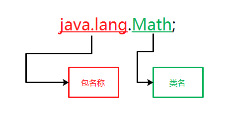

# 第十一章: 类的高级特性 #
类除了具有普通的特性之外，还具有一些高级特性，如包、内部类等。包在整个管理过程中起到了非常重要的作用，使用包可以有效地管理繁杂的类文件，解决类重名的问题，当在类中配合包与权限修饰符使用时，可以控制其他人对类成员的访问。同时在Java中一个更为有效的隐藏实现细节的技巧是使用内部类，通过使用内部类机制可以向上转型为被内部类实现的公共接口。由于在类中可以定义多个内部类，实现接口的方式也不止一个，只要将内部类中的方法设置为类最小范围的修饰权限即可将内部类的实现细节有效地隐藏。

## 本章目标：
- 掌握包的创建规则
- 掌握在程序中导入其他类包
- 掌握final变量、方法、类
- 掌握内部类

## 一、类包 ##
在Java中每定义好一个类，通过Java编译器进行编译之后，都会生成一个扩展名为.class的文件，当这个程序的规模逐渐庞大时，就很容易发生类名称冲突的现象。那么JDK API中提供了成千上万具有各种功能的类，又是如何管理的呢？Java中提供了一种管理类文件的机制，就是类包。

### 类名冲突 ###
Java中每个接口或类都来自于不同的类包，无论是Java API中的类与接口还是自定义的类与接口都需要隶属于某一个类包，这个类包包含了一些类和接口。如果没有包的存在，管理程序中的类名称将是一件非常麻烦的事情。如果程序只由一个类定义组成，并不会给程序带来什么影响，但是随着程序代码的增多，难免会出现类同名的问题。例如，在程序中定义一个Login类，因业务需要，还要定义一个名称为Login的类，但是这两个类所实现的功能完全不同，于是问题就产生了，编译器不允许存在同名的类文件。解决这类问题的办法是将两个类放置在不同的类包中。

### 完整的类路径 ###
一个完整的类名需要包名与类名的组合，每个类都隶属于一个类包，只要保证同一类包中的类不同名，就可以有效地避免同名类冲突的情况。

实例：在程序中使用两个不同的 Date 类的完整类路径，可以使用如下代码：

	...
	
在 Java 中采用类包机制非常重要，类包不仅可以解决类名冲突问题，还可以在开发庞大的应用程序时，帮助开发人员管理庞大的应用程序组件，方便软件复用。

> 同一个包中的类相互访问时，可以不指定包名。

### 创建包 ###
在类中定义包名的语法如下：

	package 包名
	
在类中指定包名时需要将package表达式放置在程序的第一行，它必须是文件中的第一行非注释代码，当使用package关键字为类指定包名之后，包名将会成为类名中的一部分，预示着这个类必须指定全名。例如，在使用位于com.lzw包下的Dog.java类时，需要使用形如com.lzw.Dog这样的表达式。

> java包的命名规则是全部使用小写字母。在Java中定义包名时通常使用创建者的域名的反序，因为域名是独一无二的，包名自然不会发生冲突。

在不同包中定义相同类名是没有问题的，在Java中使用包可以有效管理各种功能的类。

### 导入包 ###
#### 1. 使用import关键字导入包 ####

#### 2. 使用import导入静态成员 ####

## 二、final变量 ##
final关键字可用于变量声明，一旦该变量被设定，就不可以再改变该变量的值。通常，由final定义的变量为常量。例如：

	final double PI=3.14;
	
如果在程序中再次对定义的final的常量赋值，编译器将不会接受。

final关键字定义的变量必须再声明时对其进行赋值操作。final除了可以修饰基本数据类型的常量，还可以修饰对象引用。由于数组也可以被看作一个对象来引用，所以final可以修饰数组。一旦一个对象引用被修饰为final后，它只能恒定指向一个对象，无法将其改变以指向另一个对象。一个既是static又是final的字段只占据一段不能改变的存储空间。

	...

## 三、final方法 ##
定义为final的方法不能被重写。

## 四、final类 ##
定义为final的类不能被继承。

## 五、内部类 ##
如果在类中再定义一个类，则将在类中再定义的那个类称为内部类。内部类可分为成员内部类、局部内部类以及匿名类。

### 1. 成员内部类 ###

### 2. 局部内部类 ###

### 3. 匿名内部类 ###

### 4. 静态内部类 ###

### 5. 内部类的继承 ###