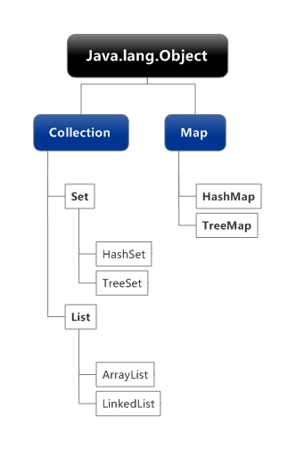

# 第十四章: 集合类 #
集合可以看作是一个容器，如红色的衣服可以看作是一个集合，所有Java类的书也可以看作是一个集合。对于集合中的各个对象很容易将其存放到集合中，也很容易将其从集合中取出来，还可以将其按照一定的顺序进行摆放。Java中提供了不同的集合类，这些类具有不同的存储对象的方式，并提供了相应的方法以方便用户对集合进行遍历、添加、删除以及查找指定的对象。学习Java一定要学会使用集合。

## 本章目标：
- 了解集合类的概念
- 掌握Collection接口
- 掌握List集合
- 掌握Set集合
- 掌握Map集合

## 一、概述 ##
java.util包中提供了一些集合类，这些集合类又被称为容器。提到容器不难想到数组，集合类与数组的不同之处是，数组的长度是固定的，集合的长度是可变的；数组用来存放基本类型的数据，集合用来存放对象的引用。常用的集合有List集合、Set集合和Map集合，其中List与Set继承了Collection接口，各接口还提供了不同的实现类。上述集合类的继承关系如图所示：

## 二、Collection接口 ##
Collection接口是层次结构中的根接口。构成Collection的单位称为元素。Collection接口通常不能直接使用，但该接口提供了添加元素、删除元素、管理数据的方法。由于List接口与Set接口都继承了Collection接口，因此这些方法对List集合与Set集合是通用的。常用方法如下所示：

	...

如何遍历集合中的每个元素呢？通常遍历集合，都是通过迭代器来实现。Collection接口中的iterator()方法可返回在此Collection进行迭代的迭代器。下面的实例就是典型的遍历集合的方法。

实例：在项目中创建类Muster，在主方法中实例化集合对象，并向集合中添加元素，最后将集合中的对象以String形式输出。

	...

## 三、List集合 ##
List集合包括List接口以及List接口的所有实现类。List集合中的元素允许重复，各元素的顺序就是对象插入的顺序。类似Java数组，用户可通过使用索引来访问集合中的元素。

## 四、Set集合 ##
Set集合中的对象不按特定的方式排序，只是简单地把对象加入集合中，但Set集合中不能包含重复对象。Set集合由Set接口和Set接口的实现类组成。Set接口继承了Collection接口，因此包含Collection的所有方法。

## 五、Map集合 ##
